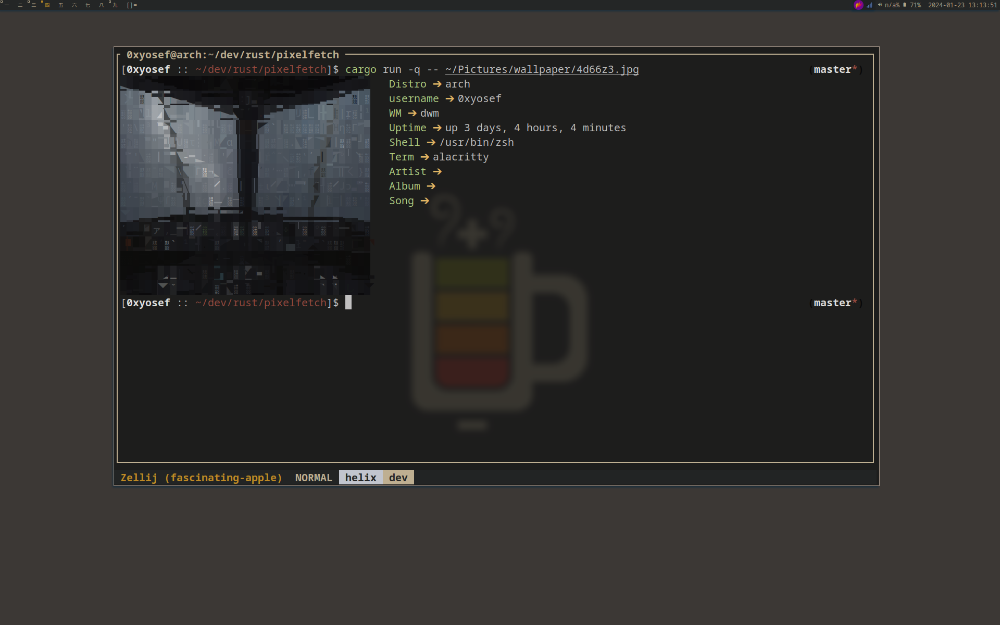
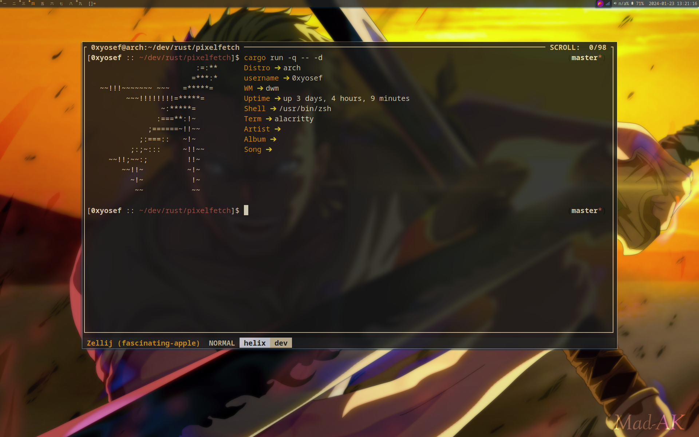
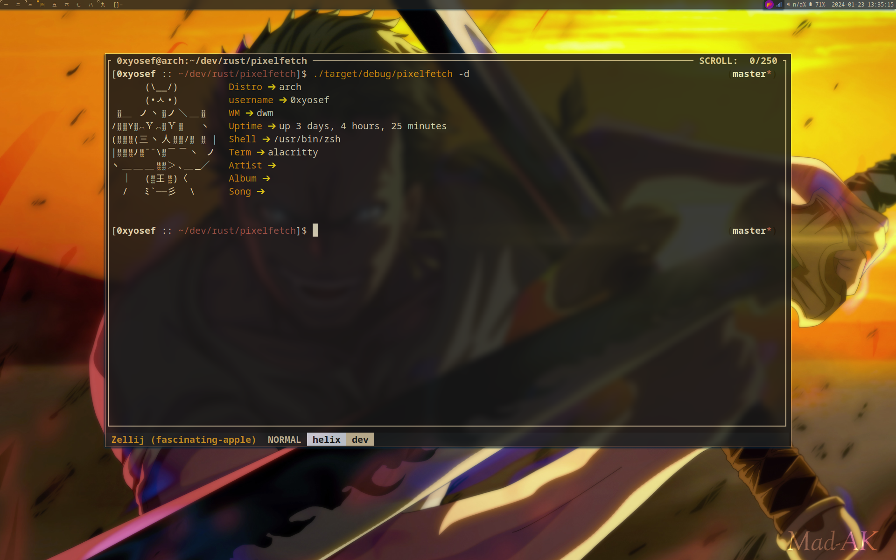

#### pixelfetch : simple tool like neofetch write with rust 🦀

# Screenshot






```bash
 cargo run -q -- -h
 ```

```
Usage: ./pixelfetch <path to a picture> or -d to default
    Examples:
            ./pixelfetch ~/Pictures/face.png
            ./pixelfetch Pictures/meet.jpg
            ./pixelfetch ./pic.png
            ./pixelfetch -d
    #these are all valid examples.
        "#
```
# Examples
``
cargo run -q -- -d
``

``
cargo run -q -- [path image]
``

# TO-DO
    - [ ] Refactor code

> If you get here, don't forget the star yooo ⭐

# Note
> after build 
```bash
cp target/debug/pixelfetch /usr/local/bin/
```

